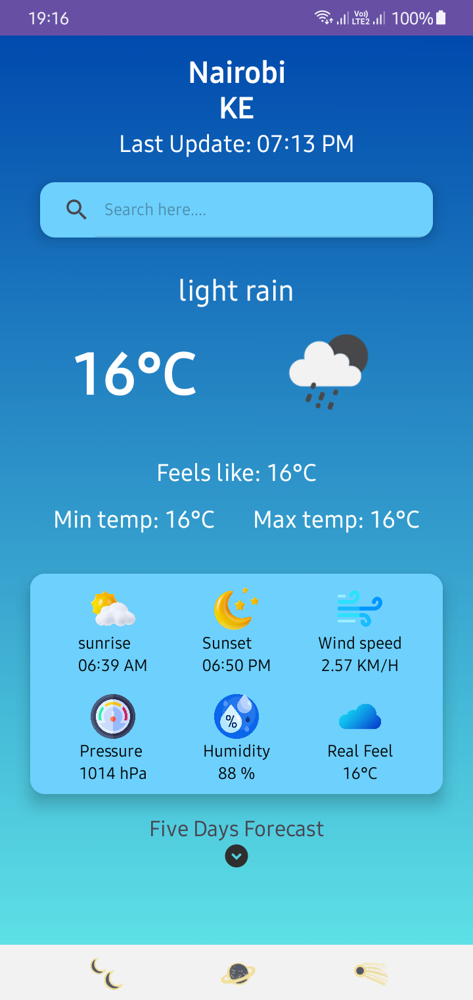
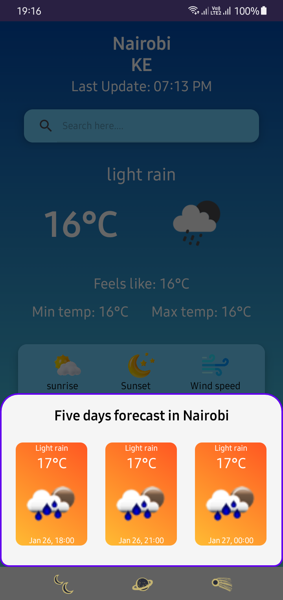
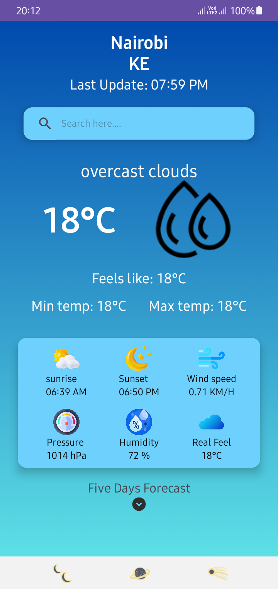
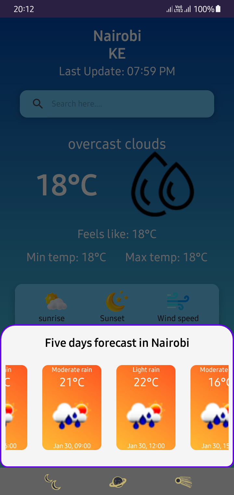

# 🌦️ Larana Weather App

A simple and intuitive Android weather app built using Kotlin. The app leverages the OpenWeather API to provide real-time weather updates for any location.

## 📋 Table of Contents

- [✨ Features](#-features)
- [🖼️ Screenshots](#-screenshots)
- - [📥 APK Download](#-apk-download)
- [⚙️ Requirements](#-requirements)
- [🛠️ Setup and Installation](#-setup-and-installation)
- [🚀 Build and Run Instructions](#-build-and-run-instructions)
- [🔍 Approach](#-approach)
- [🧩 Challenges and Solutions](#-challenges-and-solutions)
- [🤝 Contributing](#-contributing)
- [📜 License](#-license)

## ✨ Features

- 🌍 Fetch real-time weather data for any location using the OpenWeather API.
- 🌡️ Displays current temperature, weather conditions, and humidity.
- 🔍 Interactive search feature for finding weather in specific cities.
- 🎨 Elegant and user-friendly interface.
- 🌡️ Supports Celsius temperature units.
- 📶 Offline support using SharedPreferences for local data storage.

## 🖼️ Screenshots

**🏠 Home Screen**  


**☀️ Weather Details**  


**📴 Offline Screen**  


**📂 Offline Weather Details**  


## 📥 APK Download

- **You can download the APK for the Larana Weather App from the following link:**

[Download APK](https://github.com/samwelnyandoro/Weather-App/releases/download/v1.0/LaranaWeatherApp-v1.0-build1.apk)

## ⚙️ Requirements

- **📱 Android Studio**: Version Meerkat or newer.
- **📜 Kotlin SDK**: Version 2.0 or newer.
- **🛠️ Gradle**: Version 8.11.0 or newer.
- **📡 API Level**: Minimum 24 (Android 7.0).
- **🔑 OpenWeather API Key**: [Get your API key here](https://openweathermap.org/api).

## 🛠️ Setup and Installation

1. **📥 Clone the Repository**

   ```bash
   git clone https://github.com/samwelnyandoro/Weather-App.git
   ```
   ```bash
   cd Weather-App
   ```

2. **📂 Open the Project in Android Studio**

   - Open Android Studio and select **File > Open...**.
   - Navigate to the cloned repository and open the project.

3. **🔄 Sync Gradle Files**

   - Android Studio will prompt you to sync Gradle files.
   - Click **Sync Now** and ensure there are no errors.

4. **🔑 Set up the OpenWeather API Key**

   - Go to the `values/strings.xml` file in the project root.
   - Add your API key as follows:
     ```xml
     <string name="api_key">your_api_key</string>
     ```

5. **📍 Enable Location Permissions**

   - Ensure your `AndroidManifest.xml` includes location permissions for accessing user location.

## 🚀 Build and Run Instructions

1. **🔧 Build the Project**

   - In Android Studio, select **Build > Rebuild Project**.

2. **▶️ Run the App**

   - Connect an Android device or start an emulator.
   - Click **Run > Run 'app'** or press **Shift + F10**.

3. **🧪 Test the App**

   - Enter a city name in the search bar to fetch and display its weather data.
   - Check offline mode by disconnecting from the network; previously fetched data should still be available.

## 🔍 Approach

1. **📝 Requirement Gathering**:
   - Identified the need for a weather app with a clean, user-friendly interface.
   - Selected the OpenWeather API for reliable and extensive weather data.

2. **🏛️ Architecture**:
   - Used MVVM (Model-View-ViewModel) architecture to separate concerns.
   - Implemented Retrofit for API calls and LiveData for reactive UI updates.
   - Added SharedPreferences for offline data persistence.

3. **🛠️ Implementation**:
   - Integrated OpenWeather API using Retrofit and Gson.
   - Used ViewModel and LiveData for observing and managing weather data.
   - Implemented Room to cache weather data locally, ensuring offline support.
   - Designed intuitive UI layouts with Material Design principles.

## 🧩 Challenges and Solutions

1. **🚧 Challenge**: Handling API rate limits.
   - **✅ Solution**: Implemented caching with Room to store and serve data locally, reducing redundant API calls.

2. **🚧 Challenge**: Ensuring seamless performance on low-end devices.
   - **✅ Solution**: Optimized API calls and reduced unnecessary background operations.

3. **🚧 Challenge**: Parsing complex JSON responses from OpenWeather API.
   - **✅ Solution**: Used Gson for efficient deserialization and created data classes for mapping JSON responses.

4. **🚧 Challenge**: Managing offline access to weather data.
   - **✅ Solution**: Used SharedPreferences to store fetched weather data locally and provide access even when the device is offline.

## 🤝 Contributing

Contributions are welcome! Please follow these steps:

1. 🍴 Fork the repository.
2. 🛠️ Create a new branch: `git checkout -b feature-name`.
3. ✏️ Commit your changes: `git commit -m 'Add some feature'`.
4. 📤 Push to the branch: `git push origin feature-name`.
5. 🔄 Submit a pull request.

## 📜 License

This project is licensed under the [MIT License](LICENSE).